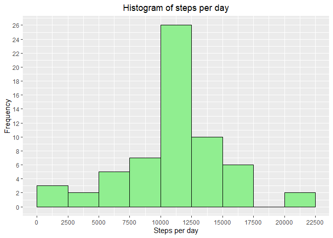
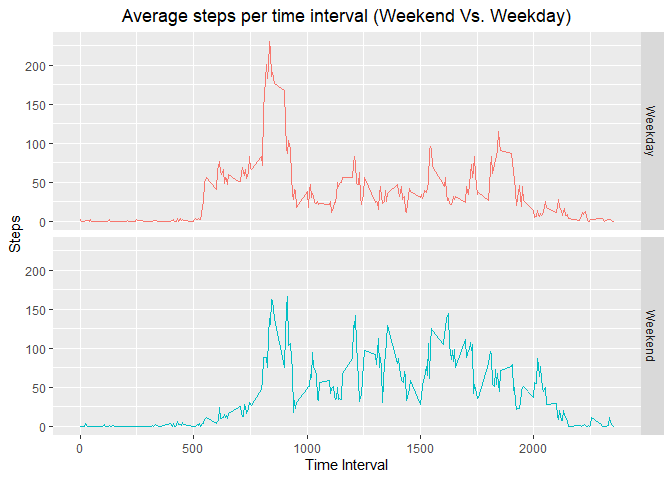

## Introduction
Analysis of measurements taken from a personal activity monitoring device. We will be looking at

1. Average daily activity pattern 
2. Compare activities performed on weekdays and weekends. 
3. Impact of missing values and filling in the missing values. 


## Loading and preprocessing the data

```r
    library(tidyverse)
    unzip('activity.zip')
    activity_df<-read.csv('activity.csv',header = TRUE)
    head(activity_df)
```

```
##   steps       date interval
## 1    NA 2012-10-01        0
## 2    NA 2012-10-01        5
## 3    NA 2012-10-01       10
## 4    NA 2012-10-01       15
## 5    NA 2012-10-01       20
## 6    NA 2012-10-01       25
```
## What is mean total number of steps taken per day?

#### a. Number of steps per day

```r
    steps_df<-activity_df %>%
          group_by(date) %>%
          summarize(StepsByDay=sum(steps))
    head(steps_df)
```

```
## # A tibble: 6 x 2
##   date       StepsByDay
##   <chr>           <int>
## 1 2012-10-01         NA
## 2 2012-10-02        126
## 3 2012-10-03      11352
## 4 2012-10-04      12116
## 5 2012-10-05      13294
## 6 2012-10-06      15420
```
#### b. Histogram of steps per day (continuous)

```r
    ggplot(data=steps_df,aes(x=StepsByDay)) +  
          geom_histogram(boundary =0,binwidth=2500,col='black',fill='cyan') + 
          scale_x_continuous(breaks=seq(0,25000,2500))+
          scale_y_continuous(breaks=seq(0,18,2)) +
          labs(title = "Histogram of steps per day",
                x = "Steps per day",
                y = "Frequency") +
          theme(plot.title = element_text(hjust = 0.5))
```

<!-- -->

#### c. Mean and Median of total number of steps 

```r
    steps_df %>%
          summarize(Mean=mean(StepsByDay,na.rm = T),
                    Median=median(StepsByDay,na.rm = T))
```

```
## # A tibble: 1 x 2
##     Mean Median
##    <dbl>  <int>
## 1 10766.  10765
```
## What is the average daily activity pattern?

#### a. Time series plot 5-minute interval (x-axis), Avg. of steps taken, averaged across all days (y-axis)

```r
    avg_steps_by_interval_df <- activity_df %>% 
          group_by(interval) %>%
          summarize(avg_steps=mean(steps, na.rm=T))
      
    ggplot(data=avg_steps_by_interval_df,aes(x=interval,y=avg_steps)) + 
          geom_line(color = "blue",size=1) +
          labs(title = "Average steps per time interval",
               x = "Time Interval",
               y = "Steps") +
          theme(plot.title = element_text(hjust = 0.5))
```

<!-- -->

#### b. Which 5 minute interval, on avearge contains the maximum number of steps

```r
    avg_steps_by_interval_df %>%
          filter(avg_steps ==max(avg_steps))
```

```
## # A tibble: 1 x 2
##   interval avg_steps
##      <int>     <dbl>
## 1      835      206.
```
## Imputing missing values
#### a. Total number of missing values

```r
    activity_df %>%
          summarise(missing_values = sum(is.na(steps)))
```

```
##   missing_values
## 1           2304
```

#### b. Using mean to replace missing values; imputed in a new column

```r
    activity_df<-activity_df %>% 
          group_by(interval) %>%
          mutate(cleaned_steps = ifelse(is.na(steps), mean(steps,na.rm=TRUE), steps))
```

#### c. New dataset with missing values filled in.


```r
    clean_activity_df<-activity_df %>%
          select(date,interval,cleaned_steps)
    head(clean_activity_df,n=10)
```

```
## # A tibble: 10 x 3
## # Groups:   interval [10]
##    date       interval cleaned_steps
##    <chr>         <int>         <dbl>
##  1 2012-10-01        0        1.72  
##  2 2012-10-01        5        0.340 
##  3 2012-10-01       10        0.132 
##  4 2012-10-01       15        0.151 
##  5 2012-10-01       20        0.0755
##  6 2012-10-01       25        2.09  
##  7 2012-10-01       30        0.528 
##  8 2012-10-01       35        0.868 
##  9 2012-10-01       40        0     
## 10 2012-10-01       45        1.47
```

#### d. Histogram of steps per day

```r
    clean_steps_df<-clean_activity_df %>%
          group_by(date) %>%
          summarize(CleanedStepsByDay=sum(cleaned_steps))

    ggplot(data=clean_steps_df,aes(x=CleanedStepsByDay)) +  
          geom_histogram(boundary =0,binwidth=2500,col='black',fill='lightgreen') + 
          scale_x_continuous(breaks=seq(0,25000,2500))+
          scale_y_continuous(breaks=seq(0,26,2)) +
          labs(title = "Histogram of steps per day",
               x = "Steps per day",
               y = "Frequency") +
          theme(plot.title = element_text(hjust = 0.5))
```

<!-- -->

#### e. Mean and Median after filling in missing values

```r
    clean_steps_df %>%
          summarize(Mean=mean(CleanedStepsByDay,na.rm = T),
                    Median=median(CleanedStepsByDay,na.rm = T))
```

```
## # A tibble: 1 x 2
##     Mean Median
##    <dbl>  <dbl>
## 1 10766. 10766.
```
##### The impact of filling in the missing values can be seen in the histogram. The y axis scale changed from 18 to 26. The mean for 5-minute interval has been used for missing values.  If a different method had been used, might have different impact.

## Are there differences in activity patterns between weekdays and weekends?
#### a. Dataset with two levels weekday and weekend

```r
    clean_activity_df<-clean_activity_df %>%
          mutate(weekday=weekdays(as.Date(date))) %>%
          mutate(daytype=ifelse(weekday == "Saturday" | weekday == "Sunday", "Weekend", "Weekday"))
    head(clean_activity_df,n=10)
```

```
## # A tibble: 10 x 5
## # Groups:   interval [10]
##    date       interval cleaned_steps weekday daytype
##    <chr>         <int>         <dbl> <chr>   <chr>  
##  1 2012-10-01        0        1.72   Monday  Weekday
##  2 2012-10-01        5        0.340  Monday  Weekday
##  3 2012-10-01       10        0.132  Monday  Weekday
##  4 2012-10-01       15        0.151  Monday  Weekday
##  5 2012-10-01       20        0.0755 Monday  Weekday
##  6 2012-10-01       25        2.09   Monday  Weekday
##  7 2012-10-01       30        0.528  Monday  Weekday
##  8 2012-10-01       35        0.868  Monday  Weekday
##  9 2012-10-01       40        0      Monday  Weekday
## 10 2012-10-01       45        1.47   Monday  Weekday
```

#### b. Comparison of steps Weekend vs. Weekday

```r
    week_clean_activity_df<-clean_activity_df %>%
           group_by(interval,daytype) %>%
           summarize(steps = mean(cleaned_steps,na.rm = T))
  
    head(week_clean_activity_df)
```

```
## # A tibble: 6 x 3
## # Groups:   interval [3]
##   interval daytype  steps
##      <int> <chr>    <dbl>
## 1        0 Weekday 2.25  
## 2        0 Weekend 0.215 
## 3        5 Weekday 0.445 
## 4        5 Weekend 0.0425
## 5       10 Weekday 0.173 
## 6       10 Weekend 0.0165
```

```r
    ggplot(data=week_clean_activity_df,aes(x=interval,y=steps,color=daytype)) + 
          geom_line(show.legend = F) +
          facet_grid(daytype~.)+
          labs(title = "Average steps per time interval (Weekend Vs. Weekday)",
               x = "Time Interval",
               y = "Steps") +
          theme(plot.title = element_text(hjust = 0.5))
```

<!-- -->
